# Neural Network From Scratch (MNIST)
## 🚀 Live Interactive Demo
Try out the model directly in your browser! The trained weights are deployed to a Hugging Face Space using a Gradio interface.  

[👉 Click here to test the Live Digit Classifier](https://huggingface.co/spaces/damiangohrh123/neural-net-from-scratch)

## 1. Introduction
This project focuses on building a neural network framework completely from scratch, without using libraries like TensorFlow or PyTorch. The goal is to understand how neural networks really work, including neurons, layers, activation functions, forward and backward propagation, and the training process. By building everything manually, the project highlights the core ideas behind how models learn rather than relying on prebuilt tools. The framework is tested on real-world data such as MNIST to show that it can learn meaningful patterns.

A neural network is a system inspired by the human brain that learns patterns from data. It is made up of neurons organized into layers, where each neuron uses weights and biases to process inputs and produce an output. These outputs are passed through activation functions, which introduce non-linearity and allow the network to learn complex relationships. The main ideas behind neural networks include using differentiable functions so learning is possible, applying non-linear activations to handle complex data, and improving performance through error-driven learning, where the model adjusts itself based on its mistakes.

## 2. System Architecture
The neural network is composed of three core components: neurons, layers, and the network itself. Each component is responsible for a specific portion of the learning process.

### 2.1 Neuron
<div align="center">
    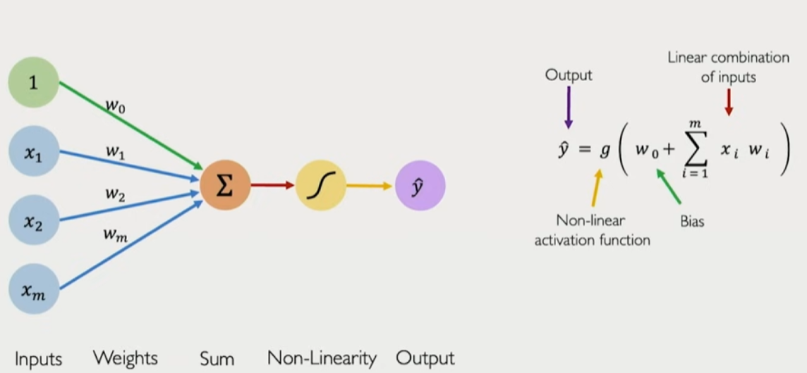
    <p align="center">Figure 1: Single Neuron Architecture [1]<p align="center">
</div>

A neuron is the fundamental building block of the network. Each neuron is responsible for taking input values, applying a weighted sum with a bias, passing it through an activation function, and storing intermediate values needed for learning.

**Attributes:**  
- Inputs: values received from previous layer or input data 
- Weights: learnable parameters associated with each input
- Bias: learnable parameter to shift the activation
- Output: the result after applying the activation function
- Delta / Gradient: the error signal used during backpropagation

**Responsibilities:**  
- Compute weighted sum:
- Apply activation function to produce output:
- Store output and delta for use in the backward pass

### 2.2 Layer
<div align="center">
    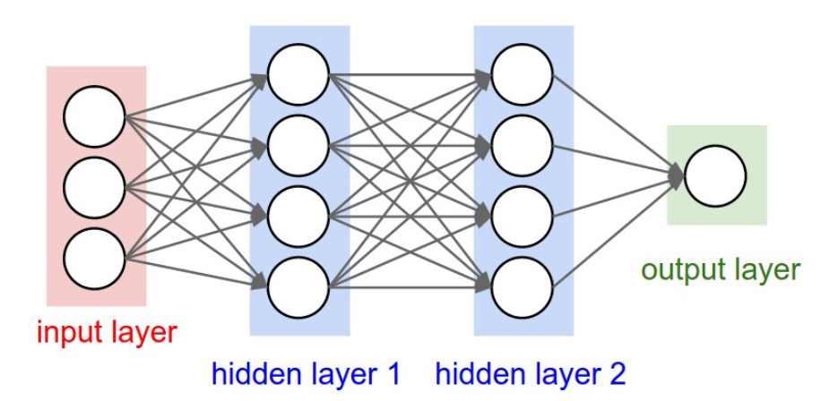
    <p align="center">Figure 2: Fully Connected Layer [2]<p align="center">
</div>

A layer consists of multiple neurons operating in parallel. Each neuron in a layer receives the same input vector and produces a corresponding output. Layers are stacked sequentially to form the network.

**Attributes:**  
- **Neurons:** collection of neurons in the layer
- **Inputs:** input vector to the layer
- **Outputs:** vector of neuron activations

**Responsibilities:**  
- Perform forward computation for all neurons
- Aggregate neuron outputs into a vector
- Store activations and weighted sums for backpropagation
- Propagate gradients during the backward pass

### 2.3 Network
The network organizes layers into an end-to-end system that transforms input images into class probabilities.

**Attributes:**  
- **Layers:** ordered list of layers (input, hidden, output)
- **Learning rate:** step size used during parameter updates
- **Loss function:** cross-entropy loss for classification

**Responsibilities:**  
1. **Forward Propagation**  
    - Pass input data sequentially through layers  
    - Store intermediate activations and pre-activation values

2. **Backpropagation**
    - Compute gradients starting from the output layer
    - Propagate error signals backward through hidden layers
    - Update weights and biases

3. **Training Loop**
    - Iterate over the training dataset
    - Perform forward pass → loss computation → backpropagation
    - Repeat for multiple epochs until convergence

## 3. Forward Propagation
Forward propagation is the process by which input data flows through the network to produce a prediction. Each layer applies a linear transformation followed by a non-linear activation function.

<div align="center">
    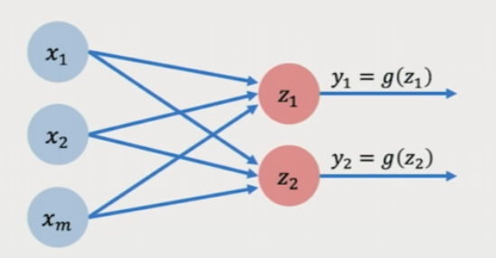
    <p align="center">Figure 3: This diagram illustrates the forward movement of data, highlighting weighted sums, activation functions, and stored intermediate values. [1]<p align="center">
</div>

### 3.1 Weighted Sum
Each neuron computes a weighted sum of its inputs:

$$
z = \sum_{i=1}^{n} w_i x_i + b
$$

Where:
* $x_i$ are input values
* $w_i$ are the learnable weights
* $b$ is the bias
* $z$ is the pre-activation value

### 3.2 Activation Function
The activation function introduces non-linearity into the network, allowing it to model complex relationships that cannot be represented by linear transformations alone. The weighted sum is passed through an activation function:

$$
a=f(z)
$$

Where:  
* $z$ is the pre-activation value
* $f$ is the activation function
* $a$ is the neuron’s output

### 3.3 Activation Functions used
**ReLU (Rectified Linear Unit)**  

$$
ReLU(z) = \max(0, z)
$$

Efficient and computationally simple. Reduces vanishing gradient issues. Common choice for deep networks

**Softmax (Output Layer)**  

$$
\sigma(\mathbf{z})_j = \frac{e^{z_j}}{\sum_{k=1}^{K} e^{z_k}}
$$

Converts raw outputs into a probability distribution, which ensures outputs sum to 1. This enables interpretation as class probabilities.

### 3.4 Data Flow Through the Network
During forward propagation, data flows sequentially through the network. Input data is passed to the first layer. Each layer computes weighted sums and applies activation functions. Outputs from one layer become inputs to the next. Final output represents the network’s prediction.

<div align="center">
    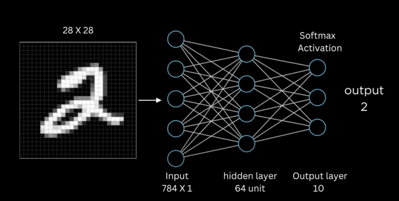
    <p align="center">Figure 4: Forward Pass Flow for MNIST. [3]<p align="center">
</div>

## 4. Loss Function
The loss function measures the discrepancy between the network’s predicted output and the true class labels. It defines the objective that the training process seeks to minimize and provides the error signal required for learning. In a classification setting such as MNIST, it evaluates how well the network assigns probability to the correct digit class by quantifying prediction error through comparison with ground-truth labels, producing a single scalar value that can be optimized using gradient descent and serving as the starting point for backpropagation to enable gradient-based learning; a lower loss value indicates better alignment between the predicted and true class distributions.

### 4.1 Cross-Entropy Loss
For MNIST classification, the network uses categorical cross-entropy loss in combination with a Softmax output layer.

$$
\mathcal{L} = -\sum_{i=1}^{C} y_i \log(\hat{y}_i)
$$

Where:
* $C$ is the number of output classes (In this case $C = 10$, the number of digit classes)  
* $y_i$ is the true label encoded as a one-hot vector  
* $y_i$ is the predicted probability for class $i$

The advantages are that it strongly penalizes confident incorrect predictions, produces stable gradients, and works naturally with Softmax activation.

**Why one-hot encoding simplifies the loss?**  
Because the true labels are one-hot encoded, all terms corresponding to incorrect classes are multiplied by zero. Only the term corresponding to the correct class contributes, so the loss simplifies to:

$$
\mathcal{L} = -\log(\hat{y}_{\text{true}})
$$

This means the loss depends only on the probability the model assigns to the correct class.

**Example:**  
Suppose the network predicts the following probabilities for a digit image: 

$$
ŷ = [0.01, 0.03, 0.92, 0.02, 0.01, 0.01, 0.01, 0.01, 0.01, 0.01]
$$

If the true digit is 2, its one-hot label is:  

$$
y=[0,0,1,0,0,0,0,0,0,0]
$$

Compute the loss:

$$
\mathcal{L} = -\sum_{i=0}^{9} y_i \log(\hat{y}_i) = -(0 \cdot \log 0.01 + 0 \cdot \log 0.03 + 1 \cdot \log 0.92 + \dots) = -\log(0.92) \approx 0.083
$$

All probabilities for the wrong digits are ignored because their $y_i = 0$. The loss only measures how confident the network is about the correct digit (digit 2 in this case). If the network is less confident $(\hat{y}_2=0.5)$, the loss is higher $(L ≈ 0.693)$. If it is very confident but wrong $(\hat{y}_2=0.01)$, the loss becomes extremely large $(L ≈ 4.61)$. This means the learning process focuses on increasing the probability of the correct class, without being affected by the incorrect ones.

## 5. Backpropagation
Backpropagation is the process of computing gradients of the loss function with respect to all network parameters, so the network can update its weights using gradient descent. It starts at the output layer and propagates the error backwards through each layer.

### 5.1 Output Layer Gradients
Before we can update the internal weights, we must first determine how much each final raw score (logit $z_i$) contributed to the total error. Since the loss $L$ is separated from the logits by the Softmax activation, we use the Multivariable Chain Rule to "peel back" the error from the loss function, through the probabilities, and back to the logits.

#### **1. Start from the chain rule:**   
The derivative of the loss $L$ with respect to each output logit $z_i$ is:

$$
\frac{\partial \mathcal{L}}{\partial z_i} = \sum_{k=1}^{C} \frac{\partial \mathcal{L}}{\partial \hat{y}_k} \frac{\partial \hat{y}_k}{\partial z_i}
$$

**What each symbol means:**  
* $L$ : Loss (single number)  
* $z_i$ : $i$-th input / logit (before activation)  
* $\hat{y}_k$: $k$-th model output (softmax probability)  
* $C$ : number of classes  
* The summation exists because each logit $z_i$ affects all softmax outputs $\hat{y}_k$  

#### **2. Compute the derivatives:** 
**Cross-Entropy Loss:**

$$
\mathcal{L} = -\sum_{i=1}^{C} y_i \log(\hat{y}_i)
$$

Where:
* $y_i$ is the true label (1 for correct class, 0 for others).
* $y_i$ is the predicted probability from softmax.

Now, when we take the partial derivative w.r.t. $\hat{y}_k$:
* We want the derivative with respect to $\hat{y}_k$. Only the term $y_k\log(\hat{y}_k)$ contains $\hat{y}_k$.
* All other terms $(y_i \log(\hat{y}_i) \text{ for } i \neq k)$ do not depend on $\hat{y}_k$, so their derivative is 0.

So we can focus only on:

$$
\frac{\partial}{\partial \hat{y}_k} [-y_k \log(\hat{y}_k)]
$$

The derivative of $-y_k \log(\hat{y}_k)$ with respect to $\hat{y}_k$ is:

$$
\frac{\partial}{\partial \hat{y}_k} [-y_k \log(\hat{y}_k)] = -y_k \frac{1}{\hat{y}_k}
$$

$$
\frac{\partial}{\partial \hat{y}_k} [-y_k \log(\hat{y}_k)] = -\frac{y_k}{\hat{y}_k}
$$

So we get:

$$
\frac{\partial L}{\partial \hat{y}_k} = -\frac{y_k}{\hat{y}_k}
$$

**Softmax:**  

$$
\hat{y}_k = \text{softmax}(z)_k = \frac{e^{z_k}}{\sum_{j=1}^{C} e^{z_j}}
$$

Let:

$$
S = \sum_j e^{z_j}
$$

So:

$$
\hat{y}_k = \frac{e^{z_k}}{S}
$$

1. Using quotient rule:

$$
\frac{\partial \hat{y}_k}{\partial z_i} = \frac{e^{z_k} \delta_{ik} \cdot S - e^{z_k} \cdot e^{z_i}}{S^2}
$$
	
2. Splitting the fraction:

$$
\frac{\partial \hat{y}_k}{\partial z_i} = \frac{e^{z_k} \delta_{ik} \cdot S}{S^2} - \frac{e^{z_k} \cdot e^{z_i}}{S^2}
$$

3. Factoring out $\frac{e^{z_k}}{S}$:

$$
\frac{\partial \hat{y}_k}{\partial z_i} = \frac{e^{z_k}}{S} \left( \frac{\delta_{ik} \cdot S}{S} - \frac{e^{z_i}}{S} \right)
$$

4. Simplify by substituting $\hat{y}_k = \frac{e^{z_k}}{S}$ back: 

$$
\frac{\partial \hat{y}_k}{\partial z_i} = \hat{y}_k (\delta_{ik} - \hat{y}_i)
$$

5. Evaluate the Kronecker delta  
    - If $k = i$: Since $\delta_{ii} = 1$, the equation becomes $\hat{y}_i(1 - \hat{y}_i)$.  
    - If $k \neq i$: Since $\delta_{ik} = 0$, the equation becomes $\hat{y}_k(0 - \hat{y}_i) = -\hat{y}_k\hat{y}_i$. 
 
$$
\frac{\partial \hat{y}_k}{\partial z_i} = 
\begin{cases} 
\hat{y}_i(1 - \hat{y}_i) & \text{if } k = i \\ 
-\hat{y}_k \hat{y}_i & \text{if } k \neq i 
\end{cases}
$$

**3. Combine and Simplify**  
Now we plug the Cross-Entropy Loss gradient and Softmax gradient into the summation by splitting it into case $k=i$ and all other $k \neq i$ cases:

$$
\frac{\partial \mathcal{L}}{\partial z_i} = 
\underbrace{\left( -\frac{y_i}{\hat{y}_i} \right) (\hat{y}_i(1 - \hat{y}_i))}_{\text{The } k=i \text{ case}} + 
\underbrace{\sum_{k \neq i} \left( -\frac{y_k}{\hat{y}_k} \right) (-\hat{y}_k \hat{y}_i)}_{\text{All } k \neq i \text{ cases}}
$$

Simplify each term (the $\hat{y}$ terms cancel out):

$$
\frac{\partial \mathcal{L}}{\partial z_i} = -y_i(1 - \hat{y}_i) + \sum_{k \neq i} y_k \hat{y}_i
$$

Expand:

$$
\frac{\partial \mathcal{L}}{\partial z_i} = -y_i + y_i \hat{y}_i + \sum_{k \neq i} y_k \hat{y}_i
$$

Factor:

$$
\frac{\partial \mathcal{L}}{\partial z_i} = -y_i + \hat{y}_i \left( y_i + \sum_{k \neq i} y_k \right)
$$

**4. Final Gradient (The Error Term)**  
Since $y$ is a probability distribution (one-hot vector), the sum of all labels $\left( y_i + \sum_{k \neq i} y_k \right)$ equals 1. Therefore, this is the final gradient:

$$
\frac{\partial \mathcal{L}}{\partial z_i} = \hat{y}_i - y_i
$$

This tells the network to simply compare $\hat{y}_i$ its prediction $y_i$ to the truth.

### 5.2 Gradients w.r.t Weights in the Output Layer
Assume the output layer is fully connected, where $z=Wa + b$ ($a$ is the activation from the previous layer).
 
**The Weight gradient:** 

$$
\frac{\partial \mathcal{L}}{\partial W} = \frac{\partial \mathcal{L}}{\partial z} \cdot a^\top
$$

This is the outer product of the error and the incoming signal. We transpose $a$ to ensure the dimensions match the shape of the weight matrix $W$.

**The Bias gradient:** 

$$
\frac{\partial \mathcal{L}}{\partial b} = \frac{\partial \mathcal{L}}{\partial z}
$$

The bias gradient is simply the error term itself.

<div align="center">
    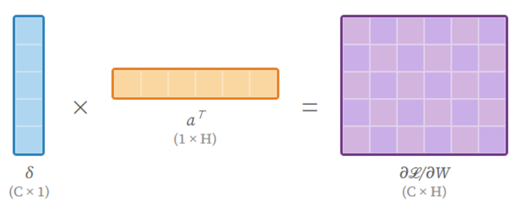
    <p align="center">Figure 5: Resulting matrix<p align="center">
</div>

The result is a matrix where every cell maps 1:1 to a specific weight from the second last layer to the output layer. This allows us to update every single weight simultaneously using the gradient descent update.

**Weight update using gradient descent**

$$
W \leftarrow W - \eta \frac{\partial \mathcal{L}}{\partial W}, \quad b \leftarrow b - \eta \frac{\partial \mathcal{L}}{\partial b}
$$

Where $\eta$ is the learning rate.

### 5.3 Backpropagation Through Hidden layers
Because hidden layers do not have a direct ground truth $(y)$ to compare against, we must “pass back” the error signal from the layer immediately following it.

**Step 1: Calculate the Hidden Layer Error ($\delta_{hidden}$)**  
We find the error for the current hidden layer by using the error from the next layer:

$$
\delta_{hidden} = (W_{next}^T \delta_{next}) \odot f'(z_{hidden})
$$

Where:
* **$\delta_{next}$ (Error Vector):** The error signal from the layer to the right (the “next” layer).
* **$W_{next}^T$ (Transposed Weights):** The weights connecting the current layer to the next. We transpose them to map the error back from the output dimension to the hidden dimension.
* **$\odot$ (Hadamard Product):** An operator for element_wise multiplication. It ensures each neuron’s error is multiplied by its own specific activation derivative.
* **$f'(z_{hidden})$ (Activation Derivative):** The derivative of the activation function evaluated at the current layer’s input $z$. 

    * When $f'(z) = 1$ (if $z > 0$): The neuron was "active" during the forward pass. The error signal passes through perfectly, allowing the weights connected to this neuron to be updated.  

    * When $f'(z) = 0$ (if $z \leq 0$): The neuron was "inactive." Multiplying by zero kills the error signal for this path. This prevents the network from trying to "fix" a neuron that didn't contribute to the final result.

**Step 2: Compute Gradients for parameters**  
Once the hidden layer error ($\delta_{hidden}$) is known, we calculate the gradients for the weights and biases of this layer.  
* **Weight Gradient: $\frac{\partial \mathcal{L}}{\partial W_{hidden}} = \delta_{hidden} \cdot a_{prev}^T$**  
This is the outer product of the current layer’s error and the transposed activations coming from the previous layer .

* **Bias Gradient: $\frac{\partial \mathcal{L}}{\partial b_{hidden}} = \delta_{hidden}$**  
The bias gradient is simply equal to the error vector for this layer.

**Step 3: Update Parameters (Gradient Descent)**

$$
W_{hidden} \leftarrow W_{hidden} - \eta \frac{\partial \mathcal{L}}{\partial W_{hidden}}
$$

$$
b_{hidden} \leftarrow b_{hidden} - \eta \frac{\partial \mathcal{L}}{\partial b_{hidden}}
$$

## 6. Gradient Descent and Parameter Updates
### 6.1 Mini-Batch Gradient Descent
Instead of updating the weights after every single image (which is noisy) or after a whole dataset (which is slow), we will use Mini-Batches. We will take a small group of N samples (like 32 images) and find the average gradient for that specific group.
The formula:

$$
W = W - \eta \frac{1}{N} \sum_{i=1}^{N} \nabla_{W} L_i
$$

$$
b = b - \eta \frac{1}{N} \sum_{i=1}^{N} \nabla_{b} L_i
$$

Where:
* $L_i$ is the loss for the $i$-th training example in the batch
* $N$ is the batch size

### 6.2 training Iterations
Training proceeds through repeated updates of the network parameters. A complete pass through the entire training dataset is called an epoch. During each epoch, the dataset is divided into multiple mini-batches, and the following steps are performed for each batch:

1. Perform forward propagation to compute predictions.
2. Compute the loss using the predicted probabilities and true labels.
3. Apply backpropagation to compute gradients.
4. Update the weights and biases using gradient descent.

Over many iterations, these updates gradually reduce the loss and improve the network’s ability to correctly classify input images.

## 7. Training Pipeline
### 7.1 Dataset Preparation
Before training, the dataset must be preprocessed to ensure that it is in a suitable format for the neural network. The MNIST dataset consists of grayscale images of handwritten digits with a resolution of 28 x 28 pixels, producing 784 pixel values per image.

**Normalization**  
Pixel values in the original images range from 0 to 255. To stabilize training and improve gradient behaviour, the pixel intensities are normalized to the range:

$$
x_{norm} = \frac{x}{255}
$$

This rescales all input values to the range $[0, 1]$, preventing excessively large activations during forward propagation.

**Flattening Images**  
Each MNIST image is originally represented as a $28\times28$ matrix, However, the fully connected neural network expects a one-dimensional input vector. Therefore, each image is flattened into a vector of length 784.


**One-Hot encoding of Labels**  
The true digit labels range from 0 to 9. For training with Softmax and Cross-Entropy Loss, the labels are converted into one-hot encoded vectors of length 10. For example digit 3 is encoded as:

$$
y = [0, 0, 0, 1, 0, 0, 0, 0, 0, 0]
$$

Each vector contains a 1 at the index corresponding to the correct class and 0 elsewhere.

### 7.2 Training Loop
**Main process**  
Once the dataset has been prepared, the network is trained using an iterative training loop. Training occurs over multiple passes through the dataset, and parameters are updated after processing mini-batches. The overall training process follows the algorithm:

        for epoch in epochs:
            for batch in dataset:
                forward_pass()
                compute_loss()
                backpropagation()
                update_parameters()

**Convergence**  
The training continues until the model converges, meaning the loss stops dropping and the network has generalized well enough to classify digits it hasn't seen before.

## 8. Implementation Design
### 8.1 Core Classes
**Layer**  
Represents a fully connected layer with:
* Weights and biases
* Forward pass: Computes the layer’s output given input activations
* Backwards pass: stores gradients with respect to weights, biases, and input

Methods:
```
forward(input)
backward(input)
```

**NeuralNetwork**  
Manages a sequence of layers and coordinates training.
* Forward propagation through all layers
* Computing loss (cross-entropy)
* Backpropagating gradients
* Updating parameters using gradient descent

Methods:

```
forward(x)
abckward(loss_gradient)
train(dataset, epochs, batch_size)
```

**Loss Function**  
Encapsulates the cross-entropy loss and provides the gradient needed for backpropagation.
- compute(predictions, labels) → returns scalar loss
- gradient(predictions, labels) → returns error for output layer

### 8.2 Training Pipeline Mapping
1. **Forward Propagation: Input batch →** ```NeuralNetwork.forward```  
    * **Input:** A batch of normalized, flattened data vectors (e.g. N samples of 784 pixels each) is passed into the input layer.
    * **Operation:** The data undergoes linear transformations  followed by non-linear activation functions at each layer.
    * **Output:** The process generates a set of predictions (y), representing the probability distribution across all possible output classes.

2. **Loss Computation:** ```Loss.compute```  
    * **Comparison:** The predicted probabilities (y) are compared against the ground-truth labels (y), which are provided in a One-Hot Encoded format.
    * **Metric:** The Cross-Entropy Loss function calculates a scalar value representing the total error for the current batch.
    * **Purpose:** This scalar serves as a performance indicator to monitor the network's convergence over time.

3. **Error Gradient Initialization:** ```Loss.gradient```  
    * **Starting Point:** Backpropagation is initialized by calculating the derivative of the loss function with respect to the output layer's activations.
    * **Calculation:** For Softmax and Cross-Entropy, the output error gradient () is calculated as the direct difference between the prediction and the target: .
    * **Role:** This gradient vector acts as the signal that will be propagated backward to determine parameter updates.

4. **Backpropagation:** ```NeuralNetwork.backward```  
    * **Propagation:** The error signal () is transmitted in reverse, from the output layer back toward the input layer.
    * **Gradient Calculation:** Each layer utilizes the incoming error signal to compute the gradients for its specific weights () and biases ().
    * **Matrix Product:** The weight gradient is derived from the outer product of the error and the transposed incoming signal from the previous layer.

5. **Parameter Update:** ```Gradient Descent```  
    * **Adjustment:** The final phase of the iteration involves the physical modification of the model's parameters.
    * **Update Rule:** The weights and biases are updated by subtracting the product of the learning rate () and the averaged batch gradients.
    * **Result:** The updated parameters represent a refined state of the network, designed to yield a lower loss in the subsequent forward pass.

## 9. Evaluation Metrics
Once the network has been trained, it is important to quantify how well it performs on unseen data. Evaluation metrics provide measurable indicators of the network’s ability to correctly classify handwritten digits.

### 9.1 Accuracy
Accuracy is the primary metric used for MNIST classification. It represents the proportion of correctly classified images relative to the total number of test images:

$$
\text{Accuracy} = \frac{\text{Number of Correct Predictions}}{\text{Total Number of Predictions}}
$$

* Values range from 0 to 1 (0 to 100%)
* High accuracy indicates that the network correctly predicts most digits

### 9.2 Confusion Matrix
A confusion matrix provides detailed insight into how the network performs on each digit class.
Rows represent true labels
* Columns represent predicted labels
* Each cell $(i, j)$ counts how many times a true digit $i$ was predicted as digit $j$
* Helps to identify which digits are most frequently misclassified
* Helps detect patterns in errors (e.g. confusing 3 and 5)

<div align="center">
    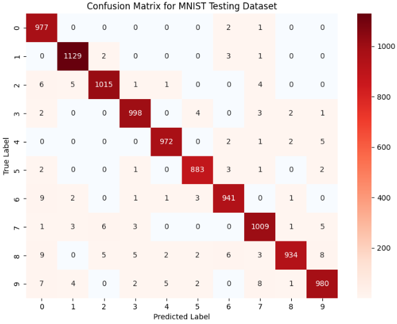
    <p align="center">Figure 6: MNIST testing dataset confusion matrix example [4]<p align="center">
</div>

### 9.3 Loss Monitoring
During training, tracking the cross-entropy loss on training and validation sets is useful because it:
* Provides insight into convergence
* Ensures that the network is learning generalizable patterns, not just memorizing training data
* Plotting loss vs. epochs helps visualize training progress and detect overfitting

## 10. Limitations
Even though the design neural network is capable of learning handwritten digit classification on the MNIST Dataset, there are several limitations to this current design.

1. Fully Connected Architecture Only
    * The network uses fully connected layers, which do not exploit spatial relationships in images.
    * This can limit performance compared to convolutional networks (CNNs).
2. No Regularization
    * Techniques such as dropout or L2 regularization are not included.
    * Without regularization, the network is more prone to overfitting, especially on small datasets.
3. Gradient Descent Only
    * Only standard gradient descent is implemented. Advanced optimizers like Adam or RMSProp are not used, which may slow convergence.

## 11. Implementation
The core of the system is a custom mathematical engine built to handle linear algebra without external dependencies.

### 11.1 Mathematical Foundation

**Matrix Operations and Linear Algebra**  
The matrix multiplication ($W \cdot x + b$) was implemented using nested list comprehensions. This operation is the algorithm for the forward pass, transforming a 784-pixel input into a 128-neuron hidden state.

```python
def dot_product(A, B):
    # Get dimensions of both matrices
    rows_A, cols_A = len(A), len(A[0])
    rows_B, cols_B = len(B), len(B[0])
    
    # Make sure A's columns match B's rows for valid multiplication 
    if cols_A != rows_B:
        raise ValueError(f"Incompatible dimensions: {cols_A} != {rows_B}")

    # Transpose B to make columns accessible as lists
    B_T = [[B[i][j] for i in range(rows_B)] for j in range(cols_B)]

    result = []
    for row_A in A:
            new_row = []
            for col_B in B_T:
                cell_value = 0
                # Pair up elements from row_A and col_B using zip, and perform dot product
                for a, b in zip(row_A, col_B):
                    cell_value += a * b
                
                new_row.append(cell_value)
                
            result.append(new_row)
        
    return result
```

**Activation Functions and Numerical Stability**    
Activation functions introduce the non-linearity required to learn complex patterns. A challenge in custom implementations is the numerical overflow, where calculating $e^x$ for large $x$ results in an infinitely large number (inf), crashing the training.
* **ReLU (Hidden Layer):** It outputs the input directly if its positive, otherwise it outputs zero.

$$
f(z) = \max(0, z)
$$

* **Stable Softmax (Output Layer):** to prevent overflow, the "Max Trick" was used. By subtracting the maximum value in the vector before exponentiating, all values are shifted into a range where $e^x \leq 1$.

$$
\sigma(z)_i = \frac{e^{z_i - \max(Z)}}{\sum e^{z_j - \max(Z)}}
$$

```python
def relu_derivative(Z: List[List[float]]) -> List[List[float]]:
    return [[1.0 if val > 0 else 0.0 for val in row] for row in Z]

def softmax(Z: List[List[float]]) -> List[List[float]]:
    # Flatten the 10x1 to a simple list of 10 numbers to find the global max
    flat_z = [row[0] for row in Z]
    max_val = max(flat_z)

    # Calculate e^(z - max) for all 10 numbers
    exps = [math.exp(val - max_val) for val in flat_z]
    
    # Sum all 10 exponentials
    sum_exps = sum(exps)

    # Return as a 10x1 column vector again
    return [[e / sum_exps] for e in exps]
```

**Loss Function: Categorical Cross-Entropy**  
To measure the error of the network, Categorical Cross-Entropy was implemented to calculate the log-likelihood of the correct class.

$$
L = -\sum y_i \log(p_i)
$$

When simplified:

$$
L = -\log(\hat{y}_{\text{true}})
$$

```python
def cross_entropy_loss(predictions: List[List[float]], targets: List[List[float]]) -> float:
    loss = 0.0
    
    # Loop through the 10 classes (rows of the column vector)
    for i in range(len(predictions)):
        # targets[i][0] gets the float value from the [[val]] structure.
        # y_i is 1 only for the correct class (One-Hot).
        # We add a tiny epsilon (1e-15) to prevent log(0) which is undefined.
        if targets[i][0] > 0.5: # 0.5 is safer than 0 for floats
            loss -= math.log(predictions[i][0] + 1e-15)

    return loss
```

### 11.2 Data Preprocessing and Binary Parsing  
This project utilizes the MNIST Database of Handwritten Digits. The raw binary files are parsed at the byte level using Python's struct and gzip modules. The dataset was downloaded from [this GitHub repository](https://github.com/fgnt/mnist).

**Binary Decoding (IDX Format)**  
The downloaded MNIST files are GZIP-compressed binary blobs. The ```IDX``` format uses a "Magic Number" header to describe the data type (e.g., unsigned bytes) and the dimensions of the tensors (e.g., $60000 \times 28 \times 28$).

```python
def load_mnist_images(filename: str) -> List[List[List[float]]]:
    with gzip.open(filename, 'rb') as f:
        # Read header (16 bytes): Magic Number, Number of Images, Rows, Columns
        magic, count, rows, cols = struct.unpack(">IIII", f.read(16))
        
        images = []
        for _ in range(count):
            # Read 784 bytes (one image)
            raw_pixels = f.read(rows * cols)

            # Normalize to [0.0, 1.0] and reshape into a 784x1 column vector for dot product operations.
            normalized_pixels = [[pixel / 255.0] for pixel in raw_pixels]
            images.append(normalized_pixels)
            
    return images
```

**Normalization and Feature Engineering**  
The raw pixel values range from 0 (white) to 255 (black). Passing large integers into a neural network can cause "Gradient Explosion", where the weights grow too large too quickly. To stabilize training, the pixels were normalized to a floating-point range of $[0, 1]$.

$$
x_{normalized} = \frac{x_{raw}}{255.0}
$$

Each $28 \times 28$ image was then flattened into a $784 \times 1$ column vector to match the input dimensions of the first layer.

**One-Hot Label Encoding**  
The network cannot calculate a "distance" between the number $3$ and the number $7$ directly. Instead, labels were converted into One-Hot Vectors. For a digit $3$, the target vector $y$ is $0$ at every index except index $3$, which is set to $1.0$.

```python
# Create One-Hot Vector
one_hot = [[0.0] for _ in range(10)]
one_hot[label_val][0] = 1.0
labels.append(one_hot)
```

### 11.3 Neural Network Architecture  
The Neural Network architecture follows a modular, layer-based design. Each layer is an independent object responsible for its own parameters, forward transformation, and gradient descent.

**Layer Configuration and Parameter Initialization**  
The model consists of a 784-unit input (flattened $28 \times 28$ image), a 128-unit hidden layer, and a 10-unit output layer.

<div align="center">
    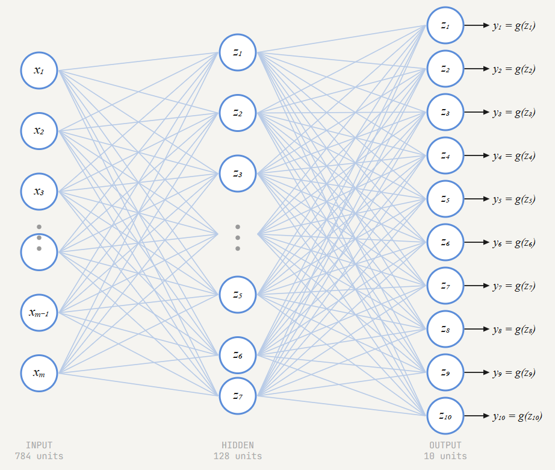
    <p align="center">Figure 7: Neural network architecture diagram<p align="center">
</div>

To ensure the model can begin learning, a Small-Scale Uniform Initialization was implemented. If weights are initialized to zero, all neurons in a layer would produce the same output and receive the same gradient, preventing the network from learning unique features (Symmetry Problem). By using ```random.uniform(-0.1, 0.1)```, each connection starts with a unique, small "strength," allowing the backpropagation algorithm to adjust them individually.

```python
# Weights: matrix of (output_size x input_size)
    self.weights: List[List[float]] = []

    for row_index in range(output_size):
        neuron_weights: List[float] = []
        
        for col_index in range(input_size):
            # Generate a small random connection strength
            weight = random.uniform(-0.1, 0.1)
            neuron_weights.append(weight)
        
        self.weights.append(neuron_weights)
```

**Forward Pass**  
Data flows through the  network in a sequential stack. Each layer computes a weighted sum of its inputs, adds a bias, and applies a non-linear activation function.
1. **Hidden Layer:** $Z_1 = W_1 \cdot X + b_1 \rightarrow A_1 = \text{ReLU}(Z_1)$
2. **Output Layer:** $Z_2 = W_2 \cdot A_1 + b_2 \rightarrow A_2 = \text{Softmax}(Z_2)$

**Backpropagation**  
Using the Chain Rule, the error at the output is propagated backward to find the partial derivatives (gradients) for every weight and bias in the system. For the output layer, the error $\delta$ is:

$$
\delta_{output} = \hat{y} - y_{true}
$$

For the hidden layer, the error is calculated by "projecting" the output error back through the weights and multiplying by the derivative of the activation function:

$$
\delta_{hidden} = (W_2^T \cdot \delta_{output}) \odot \text{ReLU}'(Z_1)
$$

```python
def backward(self, loss_gradient: List[List[float]], learning_rate: float):
        # Output Layer Error (delta2 = y_hat - y)
        delta2 = loss_gradient 
        
        # Hidden Layer Error (delta1)
        W2_T = transpose(self.layers[1].weights)
        error_signal1 = dot_product(W2_T, delta2)
        delta1 = hadamard_product(error_signal1, relu_derivative(self.layers[0].z))

        # Calculate Gradients for output layer
        dW2 = dot_product(delta2, transpose(self.layers[0].output))
        db2 = delta2

        # Calculate Gradients for hidden layer
        dW1 = dot_product(delta1, transpose(self.layers[0].input_data))
        db1 = delta1

        # Update weights and biases by stepping in the opposite direction of the gradient
        self.layers[1].weights = subtract_matrices(self.layers[1].weights, scalar_multiply(dW2, learning_rate))
        self.layers[1].biases = subtract_matrices(self.layers[1].biases, scalar_multiply(db2, learning_rate))
        self.layers[0].weights = subtract_matrices(self.layers[0].weights, scalar_multiply(dW1, learning_rate))
        self.layers[0].biases = subtract_matrices(self.layers[0].biases, scalar_multiply(db1, learning_rate))
```

### 11.4 Training and Optimization  
The ```Trainer``` class manages the iterative process of showing data to the network and refining its parameters. To optimize the training process in a pure Python environment, Mini-Batch Gradient Descent was employed.

**Mini-Batch Strategy**  
A Batch Size of 32 was chosen to allows the model to calculate a more stable gradient by averaging the error of 32 different images before making a weight adjustment.

**The Training Loop**  
For each epoch, the system executes the following steps:  
1. **Shuffling:** The training data is randomized to ensure the model does not learn patterns based on the order of the files.
2. **Forward-Backward Cycle:** Each image in the batch is passed through the network to calculate the loss, followed by a backward pass to calculate the gradients.
3. **Parameter Update:** After 32 images, the weights ($W$) and biases ($b$) are updated using the learning rate ($\eta$):

    $$
    W_{new} = W_{old} - \eta \cdot \frac{1}{m} \sum_{i=1}^{m} \nabla L_i
    $$

    Where $m$ is the batch size and $\nabla L$ is the gradient of the loss.

This part of the code iterates through epochs, shuffling data to ensure the model doesn't learn the order of images, and slicing the data into mini-batches:

```python
for epoch in range(epochs):
    # Shuffle to prevent the model from learning the sequence of the data.
    random.shuffle(dataset)
    epoch_loss = 0.0
    
    # Process data in Mini-Batches
    for i in range(0, len(dataset), batch_size):
        # Slice the dataset into a sub-list of size batch_size.
        batch = dataset[i : i + batch_size]

        # Perform forward/backward passes and accumulate the loss.
        batch_loss = self.train_mini_batch(batch)
        epoch_loss += batch_loss
```

This part of the code handles the forward-backward cycle:

```python
# Iterate through each image (x) and its one-hot label (y) in the batch
for x, y in batch:
    # Forward Pass
    predictions = self.network.forward(x)

    # Compute Loss
    total_loss += cross_entropy_loss(predictions, y)

    # Initial Error Gradient
    loss_grad = cross_entropy_gradient(predictions, y)

    # Backpropagation & Update
    self.network.backward(loss_grad, self.learning_rate)
```

**Hyperparameter Selection**  
The performance of the model is heavily influenced by the Learning Rate ($\eta$).
* **Selected Rate:** $0.01$
* **Justification:** A higher rate (e.g., $0.1$) caused the loss to fluctuate or "explode" due to the lack of advanced optimizers like Adam. A lower rate (e.g., $0.001$) made the training too slow for a pure Python implementation. At $0.01$, the model showed a smooth, logarithmic decay in loss.

**Model Persistence (JSON)** 
Because training takes several hours, it was essential to save the "state" of the neural network. A custom serialization method was written to convert the 101,770 weights and biases into a standard JSON format.

```python
def save_model(self, filename: str):
    model_data = {
        "layers": [
            {"weights": layer.weights, "biases": layer.biases}
            for layer in self.layers
        ]
    }
    with open(filename, 'w') as f:
        json.dump(model_data, f)
    print(f"Model saved to {filename}")
```

## 12. Results and Analysis
This section provides a quantitative and qualitative assessment of the neural network's performance. By evaluating the model on 10,000 test images, we measure its true ability to generalize learned features to real-world handwriting.

### 12.1 Quantitative Analysis: Training Metrics  
**Convergence and Loss Decay**  
The training process utilized Categorical Cross-Entropy as the objective function. The model demonstrated stable and rapid convergence. Starting from an initial loss of 2.27, the network achieved a rapid descent in the first two epochs. 

<div align="center">
    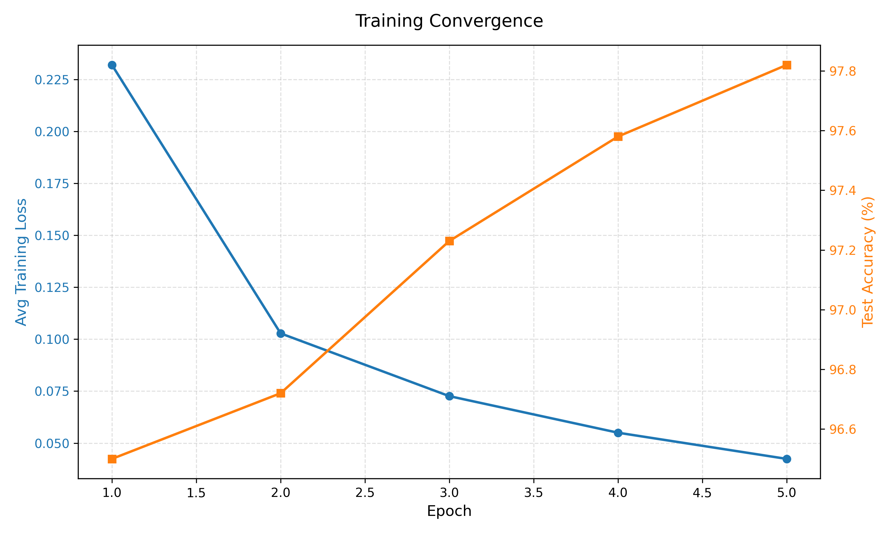
    <p align="center">Figure 8: Training Loss vs. Accuracy Curve<p align="center">
</div>

The model concluded with a final test accuracy of 97.82%. In a set of 10,000 unseen images, the network successfully identified 9,782 of them.

**Overfitting Check**  
In our results, the Test Accuracy tracked closely with the Training Loss throughout all five epochs. Because the test accuracy continued to rise and reached 97.82% without a subsequent dip, we can confirm the model maintains strong generalization capabilities.

<div align="center">
    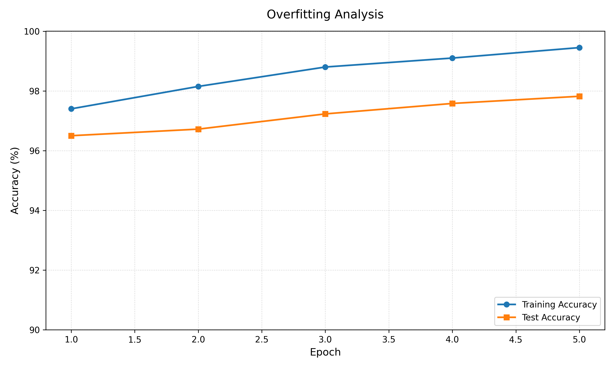
    <p align="center">Figure 9: Overfitting Analysis<p align="center">
</div>

### 12.2 Confusion Matrix  
To understand the "visual logic" of the network, we analyze the distribution of its errors across the ten digit classes in Figure 10.

<div align="center">
    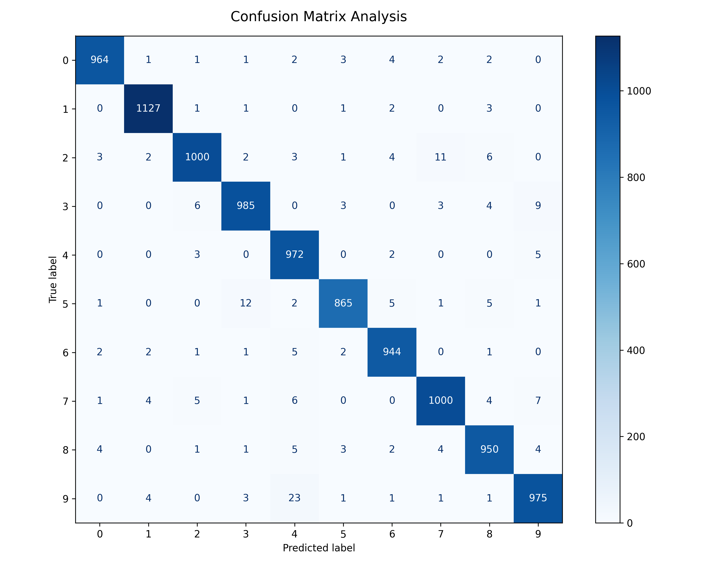
    <p align="center">Figure 10: Digit Confusion Matrix<p align="center">
</div>

The confusion matrix reveals that while the diagonal (correct classifications) is dominant, specific "feature overlaps" exist between certain digits:

* **Digit 4 and 9:** The model misclassified a "9" as a "4" 23 times. Geometrically, these digits both share a vertical stem and a closed upper loop. If the top of the "9" is slightly slanted or the "4" is closed-top, their flattened pixel vectors become mathematically similar.

<div align="center">
    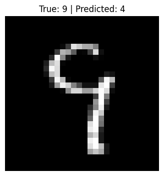
    <p align="center">Figure 11: Digit "9" misclassified as a "4"<p align="center">
</div>

* **Digit 3 and 5:** There were 12 instances where a "5" was mistaken for a "3". This typically occurs when the top horizontal stroke of the "5" is disconnected or curved, mimicking the upper arc of a "3".

<div align="center">
    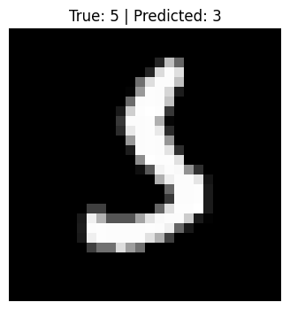
    <p align="center">Figure 12: Digit "5" misclassified as a "3"<p align="center">
</div>

* **Peak Precision:** The model was most successful with the digit "1", correctly identifying 1,127 samples with almost zero confusion. This is likely due to the unique, high-density vertical stroke that has very little feature overlap with circular digits like "0" or "8".

<div align="center">
    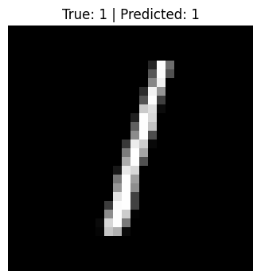
    <p align="center">Figure 13: Digit "1" classified correctly<p align="center">
</div>

### 12.3 Summary of Final Metrics  
<div align="center">

| Metric | Result | Note |
| :--- | :--- | :--- |
| **Final Test Accuracy** | 97.82% | 9,782 / 10,000 correct |
| **Average Final Loss** | 0.0424 | Stable cross-entropy convergence |
| **Most Confused Pair** | 9 as 4 | 23 occurrences |
| **Best Performing Digit** | 1 | 1,127 correct samples |
<p align="center">Table 1: Final Metrics table<p align="center">
</div>

## 13. Limitations
While the model achieved high accuracy, the development process revealed several inherent constraints of building a neural network from scratch without hardware acceleration.

The most significant bottleneck was the training time. Training 5 epochs on 60,000 images took approximately 2.5 hours on the AMD Ryzen 7 7800X3D (8-Core, 4.20 GHz). The current implementation relies on standard Python lists and basic loops for matrix operations. This restricted the Ryzen 7 CPU to single-threaded execution, leaving roughly 94% of the processor's potential idle. While the system had a Graphics Card, it remained completely unutilized. In a professional framework like PyTorch, the GPU would perform the 784x128 matrix multiplications in parallel across thousands of CUDA or Stream cores, likely reducing the 2.5-hour training time.

The current architecture uses a "List of Lists" structure for matrices. While intuitive for learning, this structure is memory-inefficient for very large networks. As the number of hidden neurons or layers increases, the overhead of Python's object management would lead to exponential increases in both memory consumption and processing latency. We used a fixed learning rate. Modern systems use adaptive optimizers (like Adam), which adjust the "step size" for each weight individually. This omission likely resulted in a slower approach to the global minimum than what is possible with state-of-the-art methods.

## 14. Conclusion  
The objective of this project was to understand how a Neural Network actually works by building a fully functional neural network from scratch. Instead of relying on high-level frameworks such as PyTorch or TensorFlow, the goal was to see what really happens behind the scenes. By avoiding these tools, the development process gave a clearer and more direct view of how a neural network operates internally.

The main success of this project was confirming that the mathematical ideas behind neural networks actually work in practice. Achieving a 97.82% test accuracy showed that the system was functioning correctly. First, the manual implementation of backpropagation proved that the Chain Rule could successfully calculate gradients across several layers, allowing the model to learn from its mistakes. Second, the activation functions played an important role. Using ReLU in the hidden layer and Softmax in the output layer helped transform raw pixel values into a clear probability distribution that the model could use for classification. Finally, numerical stability was an important challenge. By implementing the "Max Trick" for Softmax and using an epsilon adjustment in the Cross-Entropy calculation, the model was able to run millions of operations during training without running into floating-point overflow or NaN errors.

Building the system from scratch revealed several important insights that are usually hidden when using modern frameworks. One of the most important lessons was that weight initialization matters a lot. During testing, it was found that initializing weights in the range of [-0.1, 0.1] worked best because it prevented neurons from becoming saturated too early in training. Another key takeaway was the importance of linear algebra. Every calculation the network made was essentially a series of dot products and matrix additions. This project showed that AI systems are fundamentally optimization problems solved using high-dimensional mathematics. Data representation also turned out to be extremely important. Converting the raw MNIST binary data into normalized 784 × 1 column vectors was just as important as the training algorithm itself, because the network depended on properly formatted inputs to learn effectively.

Overall, this project works as a strong proof-of-concept for building custom AI systems. Although modern libraries make development faster and easier, creating a neural network from scratch provides a deeper understanding that is difficult to get otherwise. In the end, this implementation demonstrates that modern AI is built on mathematical ideas that are surprisingly simple and accessible once they are understood.

## 14. References
[1] MIT, "Introduction to deep learning," 6.S191, [Online]. Available: http://introtodeeplearning.com/

[2] Stanford University, "CS231n: deep learning for computer vision," [Online]. Available: http://cs231n.stanford.edu/

[3] K. A. Kushal, "MNIST(hand written digit) classification using neural network(step by step) from scratch," Medium, [Online]. Available: https://medium.com/@koushik.ahmed.kushal

[4] S. G. S. Girsang, "The misclassification likelihood matrix: some classes are more likely to be misclassified than others," ResearchGate, [Online]. Available: https://www.researchgate.net/publication/327246525